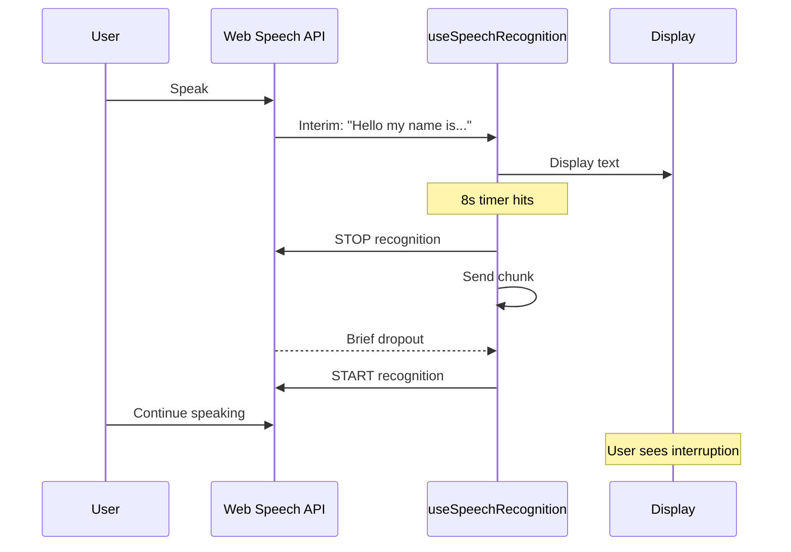
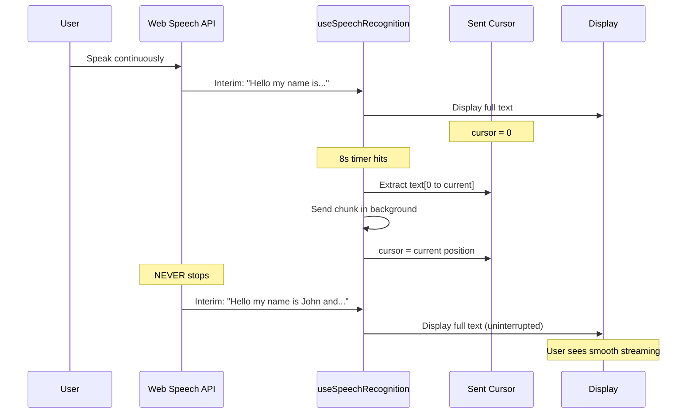

# Continuous Speech Recognition with Background Chunking

## Problem

Current implementation stops and restarts Web Speech API every 8 seconds to chunk text, causing:

- Brief audio dropouts
- Interruption in listening
- Jarring user experience

## Solution

Keep recognition running continuously, using a "sent cursor" to track which text has been chunked and sent. Crucially, we must **reconstruct** the transcript from the API's `event.results` on every event to account for the API's internal auto-corrections of previous interim words before we commit them to a chunk.

### Current Flow (Stop/Restart)




### Proposed Flow (Continuous)




## Implementation Details

### File: `frontend/src/hooks/useSpeechRecognition.ts`

#### New State/Refs Required

Add:

- `sentCursorRef = useRef(0)` - tracks character position of last sent text
- `fullTranscriptRef = useRef("")` - accumulates ALL text (final + interim) currently known by the API

#### Key Logic Changes

**Current approach (lines ~88-101):**

- When 8s/75 words hit: `forceFinalization()` stops recognition, sends chunk, restarts
- Problem: causes dropout

**New approach:**

- When 8s/75 words hit: `extractAndSendChunk()` 
- Extract: `chunk = fullTranscript.substring(sentCursor, current)`
- Send chunk via `onTranscriptRef.current(chunk, true)`
- Update: `sentCursor = fullTranscript.length`
- Recognition NEVER stops
- Reset 8s timer for next chunk

**Visual display:**

- `interimTranscript` state updates on every event to show the full reconstructed text.
- User sees continuous streaming.

#### Detailed Changes

1. **Add new refs** (after line 32):
```typescript
const sentCursorRef = useRef(0);
const fullTranscriptRef = useRef("");
```


2. **Replace `forceFinalization` function** with:
```typescript
const extractAndSendChunk = useCallback(() => {
  const fullText = fullTranscriptRef.current;
  // Safety: only send if we have new content
  if (fullText.length <= sentCursorRef.current) return;

  const chunk = fullText.substring(sentCursorRef.current).trim();
  
  if (chunk && onTranscriptRef.current) {
    onTranscriptRef.current(chunk, true); // Send as final
  }
  
  // Update cursor to current position
  sentCursorRef.current = fullText.length;
  
  // Reset timer for next chunk
  if (forceFinalizationTimerRef.current) {
    clearTimeout(forceFinalizationTimerRef.current);
  }
  interimStartTimeRef.current = Date.now();
  forceFinalizationTimerRef.current = setTimeout(() => {
    extractAndSendChunk();
  }, 8000);
}, []);
```


3. **Modify `onresult` handler** (around line 60-101):

Instead of appending or relying on `resultIndex` simply:

1. Iterate through *all* `event.results` to build the `currentFullText`.

- *Rationale:* The Web Speech API often revises "interim" parts of the string. Rebuilding ensures we have the latest corrected version.

2. Update `fullTranscriptRef.current = currentFullText`.
3. Update `setInterimTranscript(currentFullText)`.
4. Check 8s/75 words threshold → call `extractAndSendChunk()`.
5. Remove all `recognition.stop()` and `recognition.start()` calls inside this handler.
6. **Handle actual final results (API Driven)**:

- While we process continuously, the API might mark a segment as `isFinal` (e.g., after a long pause).
- We rely on our `extractAndSendChunk` timer primarily, but if `event.results` resets (browser dependent behavior), we must handle it. 
- *Chrome Behavior:* With `continuous=true`, `event.results` usually keeps growing. We will assume it grows. If `event.resultIndex` resets to 0 (indicating a new session context from the browser), we should treat that as a reset point.

5. **Handle stop/cleanup**:

- When user stops listening: send remaining text after cursor
- On errors: reset cursor and fullTranscript

## Benefits

- **Zero audio dropouts:** Recognition never interrupts.
- **Smoother UX:** Text streams continuously without hiccups.
- **Better chunking:** Natural speech flow preserved.
- **Stability:** Reconstructing transcript on every event captures API auto-corrections.

## Risks & Mitigations

- **Mid-word splitting:** A chunk might cut a word or sentence in half.
- *Mitigation:* The `Gardener` agent now has access to the full `recent_transcript` in Neo4j (Gate 7 feature), allowing it to resolve ambiguities or "Ghost Nodes" created by split context.
- **Browser Memory:** Very long sessions might make `event.results` large.
- *Mitigation:* Unlikely to be an issue for typical <1 hour sessions.

## Testing Checklist

After implementation:

1. Speak continuously for 30+ seconds - verify no audio interruptions
2. Check console - should see chunks sent every ~8 seconds
3. Visual display should show uninterrupted text streaming
4. Backend should receive chunks smoothly