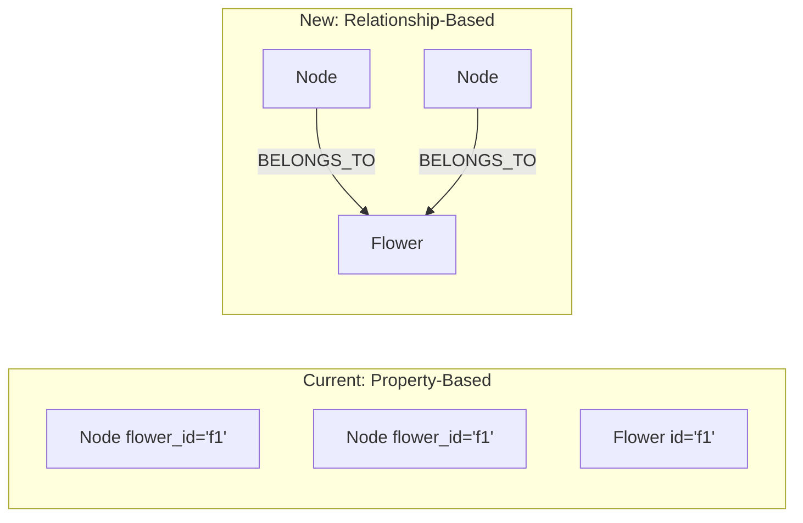
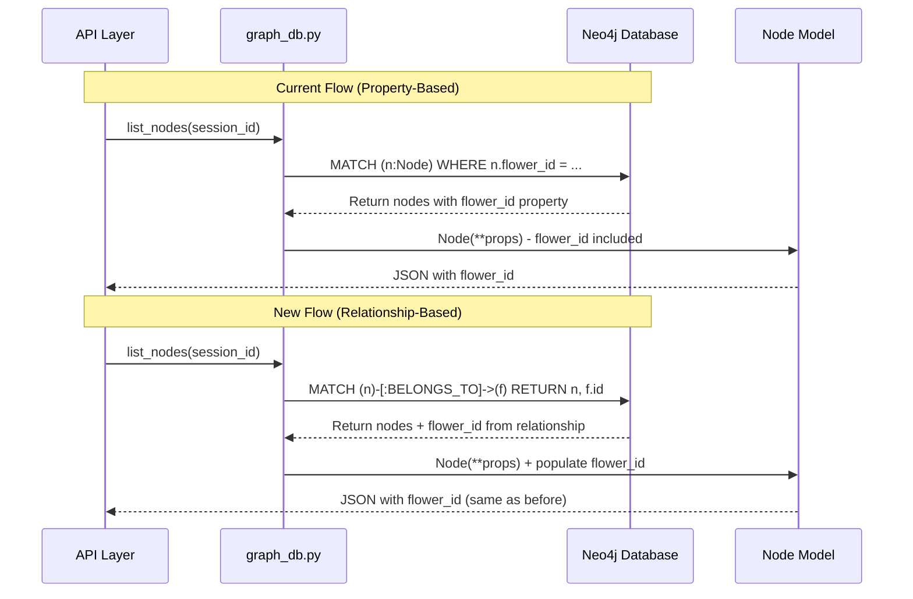

# Flower Relationship Migration Plan

## Overview

Migrate from storing flower membership as a node property to using explicit Neo4j relationships:**Current:** `(:Node {flower_id: "flower_123"})`**New:** `(:Node)-[:BELONGS_TO]->(:Flower)`This is a clean-cut migration with no data preservation needed (testing environment).

## Data Model Comparison




## Impact Summary

- **Backend Files:** 6 files (~120 lines changed)
- **Frontend Files:** 0 files (API contract unchanged)
- **Database:** Fresh start required
- **Risk:** LOW (testing environment)
- **Effort:** 2-3 hours

---

## Step 1: Database Reset

Since we're in testing, completely reset Neo4j to start fresh.**Action:**

```bash
# Stop backend server first
# Then reset Neo4j
docker compose down
docker volume rm docker_neo4j_data
docker compose up -d neo4j
```

Wait for Neo4j to be ready at http://localhost:7474---

## Step 2: Update Data Models

### File: [`backend/app/models/node.py`](backend/app/models/node.py)

**Current State:**

```python
class Node(BaseModel):
    flower_id: Optional[str] = None
```

**Decision:** Keep `flower_id` in the model for API responses, but it will be populated from relationship queries rather than stored as a property.**Change:** Add comment to clarify this is derived, not stored:

```python
class Node(BaseModel):
    flower_id: Optional[str] = None  # Derived from BELONGS_TO relationship, not stored
```

**Why:** This preserves the API contract - frontend still receives `flower_id` in JSON responses.---

## Step 3: Core Database Layer Changes

### File: [`backend/app/services/graph_db.py`](backend/app/services/graph_db.py)

This file requires the most changes - all flower membership operations.

#### 3A: Update Property Serialization

**Location:** `_node_to_properties()` function (around line 400)**Current:**

```python
def _node_to_properties(node: Node, session_id: str) -> Dict[str, Any]:
    data = node.model_dump()
    if data.get("flower_id") is None:
        data.pop("flower_id", None)
    # ... rest
```

**Change:** Always exclude `flower_id` since it's now a relationship:

```python
def _node_to_properties(node: Node, session_id: str) -> Dict[str, Any]:
    data = node.model_dump()
    data.pop("flower_id", None)  # Never store - it's a relationship now
    # ... rest
```


#### 3B: Update Node Retrieval Queries

**Location:** `list_nodes()` function (around line 120-140)**Current:**

```python
async def list_nodes(session_id: str, flower_id: Optional[str] = None):
    if flower_id:
        query = "MATCH (n:Node {session_id: $session_id, flower_id: $flower_id})"
    else:
        query = "MATCH (n:Node {session_id: $session_id})"
```

**Change:** Use relationship-based queries:

```python
async def list_nodes(session_id: str, flower_id: Optional[str] = None):
    if flower_id:
        query = """
        MATCH (n:Node {session_id: $session_id})-[:BELONGS_TO]->(f:Flower {id: $flower_id})
        RETURN n, f.id as flower_id
        """
    else:
        query = """
        MATCH (n:Node {session_id: $session_id})
        OPTIONAL MATCH (n)-[:BELONGS_TO]->(f:Flower)
        RETURN n, f.id as flower_id
        """
    
    # When building results, populate flower_id from query result
    # node_data = dict(record["n"])
    # node = Node(**node_data)
    # node.flower_id = record.get("flower_id")  # From relationship!
```

**Critical:** The query now returns `flower_id` separately - must populate it into the Node model.

#### 3C: Update get_node() Function

**Location:** `get_node()` function (around line 100)**Change:** Similar pattern - include `OPTIONAL MATCH` for flower:

```python
async def get_node(session_id: str, node_id: str) -> Optional[Node]:
    query = """
    MATCH (n:Node {id: $node_id, session_id: $session_id})
    OPTIONAL MATCH (n)-[:BELONGS_TO]->(f:Flower)
    RETURN n AS node, f.id as flower_id
    """
    
    # ... execute query ...
    # node = Node(**node_props)
    # node.flower_id = record.get("flower_id")
```


#### 3D: Add New Function for Flower Membership

**Location:** Add after `update_node()` function**New Function:**

```python
async def set_node_flower(
    session_id: str,
    node_id: str,
    flower_id: Optional[str]
) -> None:
    """
    Assign node to flower via BELONGS_TO relationship.
    If flower_id is None, removes node from any flower.
    """
    async with get_driver().session() as session:
        if flower_id is None:
            # Remove from any flower
            query = """
            MATCH (n:Node {id: $node_id, session_id: $session_id})
            OPTIONAL MATCH (n)-[r:BELONGS_TO]->(:Flower)
            DELETE r
            """
            await session.run(query, node_id=node_id, session_id=session_id)
        else:
            # Set flower membership (replace any existing)
            query = """
            MATCH (n:Node {id: $node_id, session_id: $session_id})
            MATCH (f:Flower {id: $flower_id, session_id: $session_id})
            
            // Remove any existing membership
            OPTIONAL MATCH (n)-[old:BELONGS_TO]->(:Flower)
            DELETE old
            
            // Create new membership
            CREATE (n)-[:BELONGS_TO]->(f)
            """
            await session.run(
                query,
                node_id=node_id,
                session_id=session_id,
                flower_id=flower_id
            )
```


#### 3E: Update delete_flower() Function

**Location:** `delete_flower()` function**Current:** May need to clear `flower_id` properties on nodes**Change:** Relationships will be automatically deleted by Neo4j cascade, but be explicit:

```python
async def delete_flower(session_id: str, flower_id: str) -> bool:
    query = """
    MATCH (f:Flower {id: $flower_id, session_id: $session_id})
    
    // Delete relationships first (explicit cleanup)
    OPTIONAL MATCH (n:Node)-[r:BELONGS_TO]->(f)
    DELETE r
    
    // Then delete flower
    DELETE f
    RETURN count(f) as deleted
    """
```

---

## Step 4: Update Scheduler/Gardener Integration

### File: [`backend/app/services/scheduler.py`](backend/app/services/scheduler.py)

**Location:** `_apply_flower_actions()` function (around line 400-450)

#### 4A: Flower Formation

**Current:**

```python
for node_id in member_ids:
    node = nodes_by_id[node_id]
    node.flower_id = flower.id
    await graph_db.update_node(session_id, node_id, flower_id=flower.id)
```

**Change:** Use new relationship function:

```python
for node_id in member_ids:
    await graph_db.set_node_flower(session_id, node_id, flower.id)
```


#### 4B: Flower Dissolution

**Current:**

```python
# Clear flower_id on all member nodes
for node in dissolved_flower_members:
    await graph_db.update_node(session_id, node.id, flower_id=None)
```

**Change:**

```python
# Remove BELONGS_TO relationships for all members
member_node_ids = [n.id for n in dissolved_flower_members]
for node_id in member_node_ids:
    await graph_db.set_node_flower(session_id, node_id, None)
```

**Alternative:** Could also just delete the flower - relationships cascade:

```python
await graph_db.delete_flower(session_id, flower_id)
# BELONGS_TO relationships automatically deleted
```

---

## Step 5: Update Export Function

### File: [`backend/app/api/export.py`](backend/app/api/export.py)

**Location:** Check if this file queries nodes/flowers directly**Action:** Review and update any queries that filter by `flower_id` property to use relationships instead.**Pattern:**

```python
# OLD: WHERE n.flower_id = $flower_id
# NEW: MATCH (n)-[:BELONGS_TO]->(f:Flower {id: $flower_id})
```

---

## Step 6: Update Tests

### File: [`backend/tests/test_graph_db.py`](backend/tests/test_graph_db.py)

**Changes Needed:**

1. Test assertions that check `node.flower_id` - ensure they still work (should, since model still has it)
2. Add new test for `set_node_flower()`:
```python
async def test_set_node_flower():
    # Create node and flower
    node = await create_node(session_id, ...)
    flower = await create_flower(session_id, ...)
    
    # Assign to flower
    await set_node_flower(session_id, node.id, flower.id)
    
    # Verify relationship exists in Neo4j
    result = await get_node(session_id, node.id)
    assert result.flower_id == flower.id
    
    # Remove from flower
    await set_node_flower(session_id, node.id, None)
    result = await get_node(session_id, node.id)
    assert result.flower_id is None
```


3. Update any direct Cypher queries in tests to use relationships

### File: [`backend/tests/test_builder_agent.py`](backend/tests/test_builder_agent.py)

**Action:** Check if tests verify flower membership - update if needed---

## Step 7: Verify Gardener Agent (Likely No Change)

### File: [`backend/app/agents/gardener.py`](backend/app/agents/gardener.py)

**Check:** `_format_nodes()` function (around line 175)**Current:**

```python
def _format_nodes(nodes):
    # Shows flower_id in prompt
    f"flower_id={node.flower_id or 'none'}"
```

**Expected:** No change needed - nodes still have `flower_id` populated from queries**Action:** Verify prompt formatting still works after migration---

## Step 8: Testing & Verification

### 8A: Backend Unit Tests

```bash
cd backend
pytest tests/test_graph_db.py -v
pytest tests/test_builder_agent.py -v
```


### 8B: Manual Integration Test

1. Start backend server:
```bash
cd backend
python -m uvicorn app.main:app --reload --port 8010
```


2. Create test session and add nodes via API:
```bash
# Create session
curl -X POST http://localhost:8010/api/sessions

# Add some nodes (via speech chunks or direct API)
# Wait for Gardener cycle to run (30 seconds)
```


3. Check Neo4j Browser (http://localhost:7474):
```cypher
// Verify relationships exist
MATCH (n:Node)-[r:BELONGS_TO]->(f:Flower)
RETURN n, r, f

// Verify no flower_id property on nodes
MATCH (n:Node)
WHERE n.flower_id IS NOT NULL
RETURN count(n)  // Should be 0
```


4. Check API response still includes flower_id:
```bash
curl http://localhost:8010/api/sessions/{session_id}/graph
# Verify nodes have "flower_id" field in JSON
```


### 8C: Frontend Test

1. Start frontend:
```bash
cd frontend
npm run dev
```


2. Open http://localhost:3000
3. Create session, start speaking, wait for flowers to form
4. Verify:

- Nodes cluster into compound nodes (flowers)
- No console errors
- Clicking flowers collapses/expands correctly
- No visual differences from before

---

## Step 9: Update Gardener System Documentation

### File: [`GARDENER_SYSTEM_OVERVIEW.md`](GARDENER_SYSTEM_OVERVIEW.md)

**Update Section:** "Data Storage > Flower Cluster Membership" (lines 401-405)**Current:**

```markdown
No physical "parent" relationship in Neo4j; cluster membership is stored as 
the property node.flower_id.
```

**Change To:**

```markdown
Flower membership is stored as an explicit BELONGS_TO relationship:
- (:Node)-[:BELONGS_TO]->(:Flower)
- This creates a proper graph structure in Neo4j
- API responses still include flower_id for backwards compatibility
```

---

## Step 10: Update Neo4j Architecture Documentation

### File: [`NEO4J_ARCHITECTURE_REPORT.md`](NEO4J_ARCHITECTURE_REPORT.md)

This is the comprehensive architectural document and needs several updates to reflect the new relationship-based model.

#### 10A: Update Node Properties Section (Line ~61)

**Location:** Section 2.1 "Node (Concepts)" properties list**Current:**

```markdown
- `flower_id` (string, nullable): Cluster membership
```

**Change To:**

```markdown
- `flower_id` (string, nullable): **API-only field** - Derived from BELONGS_TO relationship, not stored in Neo4j
```


#### 10B: Add BELONGS_TO Relationship to Relationship Types Section

**Location:** After the existing relationship type documentation (around sections covering edge relationships)**Add New Section:**

````markdown
### BELONGS_TO Relationship

**Type:** Structural edge relationship  
**Pattern:** `(:Node)-[:BELONGS_TO]->(:Flower)`  
**Direction:** Node to Flower (unidirectional)

**Purpose:** Explicitly defines flower cluster membership in the graph structure.

**Properties:** None

**Lifecycle:**
- **Created:** When Gardener agent forms flowers (via `set_node_flower()`)
- **Updated:** When node moves between flowers (old relationship deleted, new created)
- **Deleted:** When flowers dissolve or nodes are removed

**Query Pattern:**
```cypher
// Get all nodes in a flower
MATCH (n:Node)-[:BELONGS_TO]->(f:Flower {id: $flower_id})
RETURN n

// Get flower for a specific node
MATCH (n:Node {id: $node_id})-[:BELONGS_TO]->(f:Flower)
RETURN f
````

**API Integration:**

- Query results populate `node.flower_id` in API responses
- Maintains backwards compatibility with frontend
- No property stored on Node - pure relationship-based

**Benefits:**

- More Neo4j-native graph structure
- Enables graph traversal queries
- Better visualization in Neo4j Browser
- Supports future relationship properties (e.g., membership_strength, joined_at)
````javascript

#### 10C: Update Data Model Diagram

**Location:** If there's a data model diagram showing node relationships

**Action:** Add `BELONGS_TO` edge from Node to Flower in any Mermaid diagrams or relationship maps.

**Example Addition:**

```mermaid
graph LR
    Node -->|BELONGS_TO| Flower
    Node -->|relates_to| Node
    Session -->|contains| Node
    Session -->|contains| Flower
````


#### 10D: Update Migration History Section

**Location:** If there's a "Changes" or "Version History" section**Add Entry:**

```markdown
### Flower Relationship Migration (December 2025)

**Change:** Migrated from property-based to relationship-based flower membership

**Before:**
- Flower membership stored as `node.flower_id` property
- Property-based queries: `WHERE n.flower_id = $flower_id`

**After:**
- Flower membership stored as `(:Node)-[:BELONGS_TO]->(:Flower)` relationship
- Relationship-based queries with `OPTIONAL MATCH`
- API still returns `flower_id` for backwards compatibility

**Impact:**
- More Neo4j-native data model
- Improved graph visualization
- No frontend changes required
```


#### 10E: Update Query Examples Section

**Location:** Any section showing example Cypher queries**Update:** Replace property-based flower queries with relationship-based queries.**Before:**

```cypher
// Get nodes in flower
MATCH (n:Node {flower_id: $flower_id})
RETURN n
```

**After:**

```cypher
// Get nodes in flower
MATCH (n:Node)-[:BELONGS_TO]->(f:Flower {id: $flower_id})
RETURN n
```

---

## Rollback Plan

If anything breaks:

```bash
# Stop servers
# Restore from git
git checkout backend/app/services/graph_db.py
git checkout backend/app/services/scheduler.py
# etc.

# Clear database and restart
docker compose down
docker volume rm docker_neo4j_data
docker compose up -d
```

**Risk:** VERY LOW - testing environment, no production data---

## Success Criteria

1. Backend tests pass
2. Nodes can be assigned to flowers via relationships
3. API responses still include `flower_id` field
4. Frontend displays flowers correctly (compound nodes)
5. Neo4j Browser shows `BELONGS_TO` relationships
6. No `flower_id` properties exist on `(:Node)` nodes in Neo4j
7. Gardener cycles complete without errors
8. Flower formation/dissolution works correctly

---

## Architecture Diagram: Query Flow Change



---

## Implementation Order

The todos will guide you through these changes in optimal order:

1. Database reset
2. Data model updates (models/node.py)
3. Core query changes (graph_db.py)
4. Scheduler integration (scheduler.py)
5. Export API review
6. Test updates
7. Backend unit tests