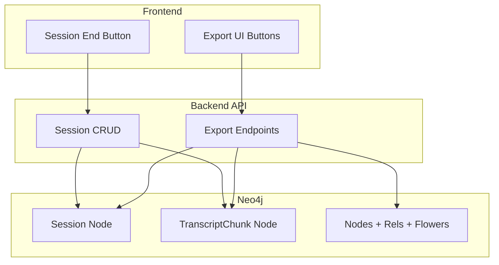

# Gate 6 — Exports + Session Lifecycle (Revised)

Based on Director approval with modifications:

- Chunk persistence added (prerequisite for exports)
- Z-filters deferred to Gate 7
- Fake mode fallback for Markdown export

---

## Architecture Overview



---

## Lane A: Session Lifecycle + Chunk Persistence

### A1. Add Session CRUD to graph_db.py

Add to [`backend/app/services/graph_db.py`](backend/app/services/graph_db.py):

```python
# Session CRUD
async def create_session(session: Session) -> Session
async def get_session(session_id: str) -> Optional[Session]
async def list_sessions() -> List[SessionSummary]
async def update_session(session_id: str, **updates) -> Session
async def delete_session(session_id: str) -> None
```

Session node properties: `id`, `name`, `created_at`, `ended_at`

### A2. Add Chunk Persistence to graph_db.py

```python
# Chunk CRUD (new)
async def save_chunk(chunk: TranscriptChunk) -> TranscriptChunk
async def list_chunks_for_session(session_id: str) -> List[TranscriptChunk]
async def delete_chunks_for_session(session_id: str) -> None
```

Add constraint to [`backend/app/services/graph_schema.py`](backend/app/services/graph_schema.py):

```python
(
    "chunk_id_unique",
    "CREATE CONSTRAINT chunk_id_unique IF NOT EXISTS FOR (c:TranscriptChunk) REQUIRE c.id IS UNIQUE",
),
```

### A3. Modify Chunk Processing

Update [`backend/app/api/chunks.py`](backend/app/api/chunks.py):

1. Check if session is ended before accepting chunks (return 409 Conflict)
2. Persist chunk to Neo4j instead of deleting after Builder processing
3. Keep in-memory store for Builder processing, add Neo4j persistence after
```python
# At start of submit_chunk:
session = await get_session(session_id)
if session and session.ended_at:
    raise HTTPException(status_code=409, detail="Session has ended")

# After Builder completes (replace delete with persist):
await save_chunk(chunk)  # Persist to Neo4j
await chunk_store.delete(chunk.id)  # Clear in-memory
```


### A4. Implement Session Endpoints

Update [`backend/app/api/sessions.py`](backend/app/api/sessions.py):

| Endpoint | Implementation |

|----------|----------------|

| `POST /sessions` | Create Session node with name (or timestamp fallback) |

| `GET /sessions` | List all Session nodes |

| `GET /sessions/{id}` | Get session + concatenate chunks for transcript |

| `POST /sessions/{id}/end` | Set `ended_at`, stop Gardener for session |

| `DELETE /sessions/{id}` | Delete session + chunks + graph data |

---

## Lane B: Export Endpoints

### B1. Export JSON

Update [`backend/app/api/export.py`](backend/app/api/export.py):

```python
@router.get("/json")
async def export_json(session_id: str) -> SessionExportBundle:
    session = await get_session(session_id)
    if not session:
        raise HTTPException(404, "Session not found")
    
    chunks = await list_chunks_for_session(session_id)
    transcript = " ".join(c.text for c in sorted(chunks, key=lambda c: c.start_time))
    
    graph = await fetch_graph_state(session_id)
    
    return SessionExportBundle(
        session=SessionDetail(..., transcript=transcript),
        graph=graph,
        metadata={"exported_at": datetime.utcnow().isoformat(), "version": "1.0"}
    )
```

### B2. Export Transcript (Plain Text)

```python
@router.get("/transcript")
async def export_transcript(session_id: str) -> PlainTextResponse:
    chunks = await list_chunks_for_session(session_id)
    transcript = "\n".join(c.text for c in sorted(chunks, key=lambda c: c.start_time))
    return PlainTextResponse(content=transcript, media_type="text/plain")
```

### B3. Export VTT

```python
@router.get("/vtt")
async def export_vtt(session_id: str) -> PlainTextResponse:
    chunks = await list_chunks_for_session(session_id)
    
    vtt_lines = ["WEBVTT", ""]
    for chunk in sorted(chunks, key=lambda c: c.start_time):
        start = _format_vtt_time(chunk.start_time)
        end = _format_vtt_time(chunk.end_time)
        vtt_lines.append(f"{start} --> {end}")
        vtt_lines.append(chunk.text)
        vtt_lines.append("")
    
    return PlainTextResponse(content="\n".join(vtt_lines), media_type="text/vtt")

def _format_vtt_time(seconds: float) -> str:
    """Convert seconds to VTT timestamp format (HH:MM:SS.mmm)"""
    ...
```

### B4. Export Markdown

Create summarisation prompt in [`backend/app/agents/summariser.py`](backend/app/agents/summariser.py):

```python
async def generate_summary(session_id: str) -> str:
    if is_fake_llm_enabled():
        return _fake_summary(session_id)  # Bullet-point fallback
    
    # LLM-generated summary using Gemini
    ...
```

Fake mode fallback returns:

```markdown
# Session Summary

## Flowers (Thematic Clusters)
- [List flower names]

## Key Concepts
- [Count] nodes extracted

## Relationships
- [Count] relationships across [categories]
```

---

## Lane C: Frontend Export UI

### C1. Add Export Panel Component

Create [`frontend/src/components/ExportPanel.tsx`](frontend/src/components/ExportPanel.tsx):

```tsx
interface ExportPanelProps {
  sessionId: string;
  onEndSession: () => void;
}

export function ExportPanel({ sessionId, onEndSession }: ExportPanelProps) {
  const downloadExport = async (format: 'json' | 'transcript' | 'vtt' | 'markdown') => {
    const response = await fetch(`/api/sessions/${sessionId}/export/${format}`);
    // Trigger browser download
    ...
  };
  
  return (
    <div className="export-panel">
      <button onClick={() => downloadExport('json')}>Export JSON</button>
      <button onClick={() => downloadExport('transcript')}>Export Transcript</button>
      <button onClick={() => downloadExport('vtt')}>Export VTT</button>
      <button onClick={() => downloadExport('markdown')}>Export Summary</button>
      <button onClick={onEndSession}>End Session</button>
    </div>
  );
}
```

### C2. Integrate into Main Page

Update [`frontend/src/app/page.tsx`](frontend/src/app/page.tsx) to include export panel.

---

## File Changes Summary

| File | Change |

|------|--------|

| `backend/app/services/graph_db.py` | Add Session + Chunk CRUD |

| `backend/app/services/graph_schema.py` | Add chunk constraint |

| `backend/app/services/__init__.py` | Export new functions |

| `backend/app/api/sessions.py` | Implement all stubs |

| `backend/app/api/chunks.py` | Add session check, persist chunks |

| `backend/app/api/export.py` | Implement all stubs |

| `backend/app/agents/summariser.py` | New file for Markdown export |

| `frontend/src/components/ExportPanel.tsx` | New component |

| `frontend/src/app/page.tsx` | Add export panel |

---

## Verification Checklist

- [ ] Session CRUD works (create, list, get, end, delete)
- [ ] Ended session rejects new chunks (409)
- [ ] Chunks persist to Neo4j (survive restart)
- [ ] Export JSON includes all entities
- [ ] Export transcript is plain text
- [ ] Export VTT has correct timestamp format
- [ ] Export Markdown works (LLM and fake mode)
- [ ] Export buttons trigger downloads
- [ ] Session end button works

---

## Non-Negotiable Compliance

Exports must preserve:

- Freeform `inferred_type` (no enum coercion in JSON export)
- Relationship `id` values
- Flower membership data
- All 5 relationship categories

---

## Deferred to Gate 7

- Z-filter panel (status, confidence, Flower, type filters)
- Filter persistence (localStorage)
- Edge hiding for filtered nodes