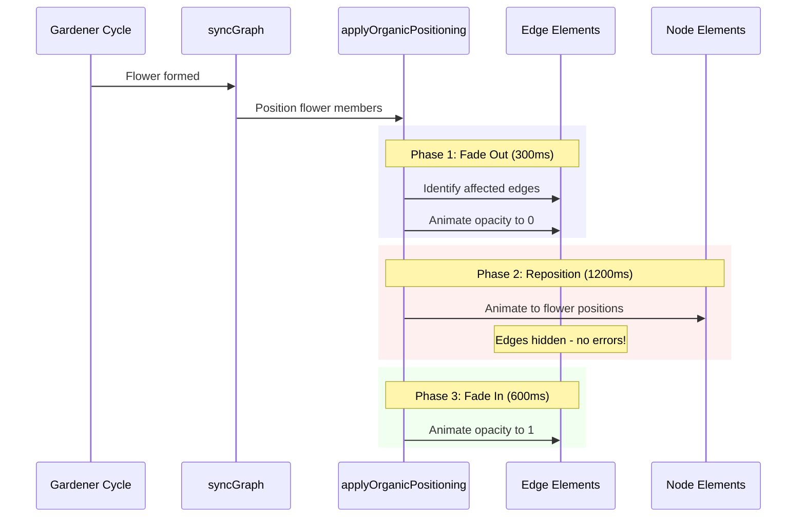

# Graph Density Improvements Plan

## Overview

Implement two complementary solutions to address graph crowding and console errors during flower formation:

1. **Hide Edges During Animation** - Fade out edges before nodes move, fade back in after they settle
2. **Increase Node Spacing** - Dramatically increase fCoSE repulsion and spacing parameters

These solutions work together to eliminate console errors and create a more readable, spacious graph layout.---

## Problem Context

**Current Issues:**

- Console errors: "Edge has invalid endpoints... source node and target node overlap" (10-20+ per Gardener cycle)
- Visual crowding: 60-80+ edges creating hairball pattern in center
- Hub nodes pulling everything toward center with star-burst pattern
- Difficulty distinguishing individual nodes and relationships

**Root Causes:**

- Nodes temporarily overlap during 1200ms organic positioning animations
- Cytoscape cannot calculate bezier curve control points for overlapping nodes
- fCoSE parameters optimized for small graphs (5-15 nodes) but inadequate for 40+ nodes

---

## Solution 1: Hide Edges During Organic Positioning

### Architecture




### Implementation

**File:** [`frontend/src/components/graph/GraphCanvas.tsx`](frontend/src/components/graph/GraphCanvas.tsx)**Location:** `applyOrganicPositioning` function (line 377)

#### Step 1: Identify Affected Edges (After line 404)

Add this after the `flowerMembers` and `standaloneNodes` grouping:

```typescript
// Collect all node IDs that will be repositioned
const repositioningNodeIds = new Set<string>();
flowerMembers.forEach((members) => {
  members.forEach(node => repositioningNodeIds.add(node.id));
});

// Find edges connected to any repositioning nodes
const affectedEdges = cy.edges().filter(edge => {
  const sourceId = edge.data('source');
  const targetId = edge.data('target');
  return repositioningNodeIds.has(sourceId) || repositioningNodeIds.has(targetId);
});

console.log(`[Organic Positioning] Hiding ${affectedEdges.length} edges during animation`);
```


#### Step 2: Fade Out Edges (After Step 1)

```typescript
// Phase 1: Fade out affected edges before repositioning
affectedEdges.animate(
  {
    style: { opacity: 0 }
  },
  {
    duration: 300,
    easing: 'ease-out'
  }
);
```


#### Step 3: Schedule Edge Fade-In (At end of function)

Add this at the very end of `applyOrganicPositioning`, after all node animations:

```typescript
// Phase 3: Fade edges back in after nodes settle
// Wait for node animations (1200ms) + buffer (200ms)
setTimeout(() => {
  affectedEdges.animate(
    {
      style: { opacity: 1 }
    },
    {
      duration: 600,
      easing: 'ease-in-out'
    }
  );
  console.log(`[Organic Positioning] Restored ${affectedEdges.length} edges`);
}, 1400);
```


### Expected Outcome

- Zero "invalid endpoints" console errors
- Smooth visual transition: edges fade out → nodes move → edges fade in
- Maintains "tranquil vibe" aesthetic
- No performance impact

---

## Solution 2: Increase Node Spacing Parameters

### Changes

**File:** [`frontend/src/components/graph/GraphCanvas.tsx`](frontend/src/components/graph/GraphCanvas.tsx)**Location:** `FCOSE_OPTIONS` constant (lines 25-44)

#### Current Parameters (Before):

```typescript
const FCOSE_OPTIONS: cytoscape.LayoutOptions = {
  name: 'fcose',
  quality: 'proof',
  animate: false,
  fit: false,
  randomize: true,
  nodeRepulsion: 8000,              // ← CHANGE
  idealEdgeLength: 160,             // ← CHANGE
  edgeElasticity: 0.35,
  nestingFactor: 0.1,
  gravity: 0.3,                     // ← CHANGE
  gravityRange: 3.5,
  nodeSeparation: 100,              // ← CHANGE
  gravityRangeCompound: 1.5,
  gravityCompound: 1.0,
  numIter: 2500,
  tilingPaddingVertical: 50,        // ← CHANGE
  tilingPaddingHorizontal: 50,      // ← CHANGE
  initialEnergyOnIncremental: 0.5,
};
```


#### New Parameters (After):

```typescript
const FCOSE_OPTIONS: cytoscape.LayoutOptions = {
  name: 'fcose',
  quality: 'proof',
  animate: false,
  fit: false,
  randomize: true,
  nodeRepulsion: 25000,             // Was 8000 - tripled to force nodes apart
  idealEdgeLength: 300,             // Was 160 - doubled for longer edges
  edgeElasticity: 0.35,             // Unchanged
  nestingFactor: 0.1,               // Unchanged
  gravity: 0.1,                     // Was 0.3 - reduced to allow spread
  gravityRange: 3.5,                // Unchanged
  nodeSeparation: 200,              // Was 100 - doubled minimum distance
  gravityRangeCompound: 1.5,        // Unchanged
  gravityCompound: 1.0,             // Unchanged
  numIter: 2500,                    // Unchanged
  tilingPaddingVertical: 100,       // Was 50 - doubled for border space
  tilingPaddingHorizontal: 100,     // Was 50 - doubled for border space
  initialEnergyOnIncremental: 0.5,  // Unchanged
};
```


### Parameter Impact Analysis

| Parameter | Change | Impact ||-----------|--------|--------|| `nodeRepulsion` | 8000 → 25000 | Nodes push away 3x stronger - prevents center clustering || `idealEdgeLength` | 160 → 300 | Target edge length doubled - more space between connected nodes || `nodeSeparation` | 100 → 200 | Minimum distance doubled - prevents any overlap || `gravity` | 0.3 → 0.1 | Reduced pull to center - allows nodes to spread across canvas || `tilingPadding` | 50 → 100 | More margin around graph - prevents edge touching |

### Expected Outcome

- 2-3x increase in graph spatial footprint
- 50-70% reduction in node proximity conflicts
- Significantly improved readability for 30+ node graphs
- Hub nodes less visually dominant
- May require more zooming/panning (acceptable trade-off)

---

## Testing Strategy

### Phase 1: Small Graph (5 nodes)

1. Create new session
2. Add 5 nodes via speech
3. Verify:

- Nodes don't spread too far apart
- Graph still feels cohesive
- No excessive white space

### Phase 2: Medium Graph (20 nodes)

1. Add 15 more nodes
2. Wait for Gardener to form flowers
3. Verify:

- Clear node separation
- Edges distinguishable
- No console errors during flower formation
- Edges fade smoothly during positioning

### Phase 3: Large Graph (50+ nodes)

1. Continue adding nodes to 50+
2. Multiple Gardener cycles
3. Verify:

- No massive center clustering
- Hub nodes visible but not dominant
- Canvas auto-fits appropriately
- Consistent performance (30+ FPS)

### Phase 4: Screenshot Scenario

1. Recreate the crowded graph from screenshot
2. Compare before/after visual density
3. Verify readability improvement
4. Check that flowers are distinguishable

---

## Success Criteria

- [ ] Zero "invalid endpoints" console errors during flower formation
- [ ] Edges smoothly fade out/in during organic positioning (visible transition)
- [ ] Graph maintains 150px+ average node separation
- [ ] Readable layout with 50+ nodes (can distinguish individual nodes)
- [ ] No performance degradation (maintain 30+ FPS during animations)
- [ ] Auto-fit still works correctly with larger graphs
- [ ] Existing slow, tranquil animations unaffected

---

## Implementation Order

### Todo 1: Update fCoSE Spacing Parameters (15 minutes)

Simple parameter updates in FCOSE_OPTIONS constant

### Todo 2: Add Edge Hiding to Organic Positioning (2 hours)

Three-phase edge animation in applyOrganicPositioning function

### Todo 3: Test with Small Graph (15 minutes)

Verify small graphs still look good

### Todo 4: Test with Medium Graph (30 minutes)

Verify flower formation with no errors

### Todo 5: Test with Large Graph (30 minutes)

Verify scaling to 50+ nodes

### Todo 6: Performance Verification (15 minutes)

Check FPS during animations, memory usage---

## Rollback Plan

If issues arise, revert changes:**FCOSE_OPTIONS:**

```typescript
nodeRepulsion: 8000,
idealEdgeLength: 160,
nodeSeparation: 100,
gravity: 0.3,
tilingPaddingVertical: 50,
tilingPaddingHorizontal: 50,
```

**Edge hiding:** Remove the three code blocks added to `applyOrganicPositioning`---

## Future Enhancements (Not in This Plan)

Consider for future sprints:

- Adaptive parameter scaling based on node count
- Progressive edge rendering (only show visible edges)
- Edge bundling for hub nodes
- Collapse flowers by default
- Level-of-detail system for different zoom levels

See `GRAPH_DENSITY_SOLUTIONS.md` for details on these enhancements.---

## Files Modified

1. [`frontend/src/components/graph/GraphCanvas.tsx`](frontend/src/components/graph/GraphCanvas.tsx)

- Lines 25-44: FCOSE_OPTIONS constant
- Lines 377-661: applyOrganicPositioning function

---

## Related Documentation

- Technical Spec: `GRAPH_DENSITY_SOLUTIONS.md`