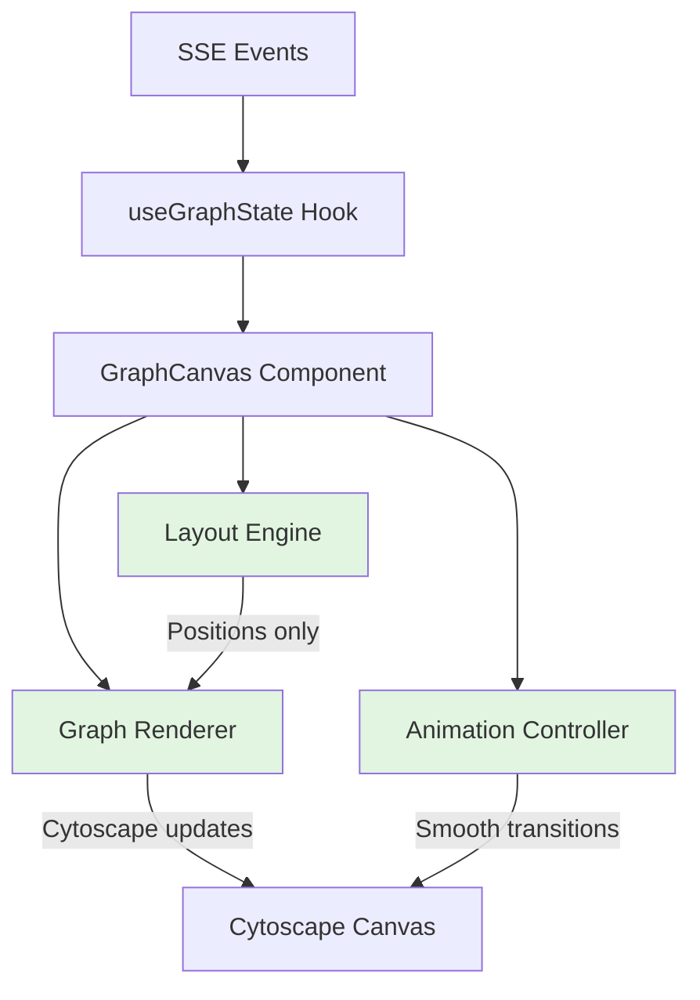

# GraphCanvas Clean Rebuild Plan v2

## Current Architecture Problems

[GraphCanvas.tsx](frontend/src/components/graph/GraphCanvas.tsx) has grown to 2017 lines with three competing animation systems causing flickering, edge errors, and overlaps.

## Design Requirements

1. **Consistent animations** - nodes and edges fade in at same speed
2. **Draggable flowers** - users can click and drag entire flower clusters
3. **Floaty effects** - new and isolated nodes have gentle floating animation
4. **Stability** - no flickering, no edge routing errors

---

## New Architecture: Separation of Concerns



**Key Principle:** Each system does ONE job, no overlap.---

## Phase 1: Extract Layout Engine (90 minutes)

Create `frontend/src/components/graph/layout/layoutEngine.ts`:

```typescript
// Pure functions - no side effects, no Cytoscape, no animations
interface LayoutResult {
  nodePositions: Map<string, { x: number, y: number }>;
  lockedNodeIds: Set<string>;
  isolatedNodeIds: Set<string>; // NEW: For floaty effect
}

export function calculateLayout(
  currentPositions: Map<string, { x: number, y: number }>,
  data: { nodes: Node[], relationships: Relationship[], flowers: Flower[] },
  options: LayoutOptions
): LayoutResult
```

**Key features:**

- Identifies isolated nodes (no flowers, low connections)
- Returns locked positions for existing nodes
- Zero Cytoscape coupling (testable)

---

## Phase 2: Extract Graph Renderer (75 minutes)

Create `frontend/src/components/graph/rendering/graphRenderer.ts`:

```typescript
export function syncGraphStructure(
  cy: Core,
  data: { nodes: Node[], relationships: Relationship[], flowers: Flower[] },
  layoutResult: LayoutResult
): SyncResult
```

**Flower implementation:**

```typescript
function renderFlowers(cy: Core, flowers: Flower[], nodes: Node[]): void {
  flowers.forEach(flower => {
    // Create compound node (parent)
    const flowerNode = cy.add({
      group: 'nodes',
      data: { id: flower.id, label: flower.label, kind: 'flower' },
      classes: 'flower',
      grabbable: true, // DRAGGABLE!
    });
    
    // Assign children
    const members = nodes.filter(n => n.flower_id === flower.id);
    members.forEach(node => {
      cy.getElementById(node.id).move({ parent: flower.id });
    });
  });
}
```

**Why this works:** Cytoscape compound nodes are draggable by default. When you drag the parent, all children move with it. No custom code needed.---

## Phase 3: Create Animation Controller (60 minutes)

Create `frontend/src/components/graph/animation/animationController.ts`:

```typescript
export class AnimationController {
  // Consistent fade durations
  private readonly FADE_DURATION = 800; // Same for nodes and edges
  private readonly FLOAT_DURATION = 3000;
  private readonly FLOAT_DISTANCE = 15;
  
  queueUpdate(syncResult: SyncResult, isolatedNodeIds: Set<string>): void
  executeQueue(cy: Core): Promise<void>
}
```

**Animation strategy:**

1. **New nodes/edges:** Fade from 0 to 1 opacity (800ms) - SAME DURATION
2. **Isolated nodes:** Add continuous gentle float effect after fade-in
3. **Flowered nodes:** No float (they're anchored to stem)
4. **Camera:** Auto-fit after animations settle (1200ms delay)

**Floaty effect implementation:**

```typescript
function applyFloatEffect(cy: Core, nodeId: string): void {
  const node = cy.getElementById(nodeId);
  
  // Gentle sine-wave oscillation
  const startPos = node.position();
  const seed = nodeId.split('').reduce((acc, c) => acc + c.charCodeAt(0), 0);
  const angle = (seed % 360) * (Math.PI / 180);
  
  // Continuous animation loop
  const animate = () => {
    if (!node.nonempty() || node.parent().nonempty()) return; // Stop if removed or flowered
    
    const offset = Math.sin(Date.now() / 3000 + seed) * 15;
    node.animate({
      position: {
        x: startPos.x + Math.cos(angle) * offset,
        y: startPos.y + Math.sin(angle) * offset,
      }
    }, {
      duration: 3000,
      easing: 'ease-in-out',
      complete: animate, // Loop
    });
  };
  
  animate();
}
```

**Result:** Isolated nodes gently float in place. When they join a flower, the animation stops naturally.---

## Phase 4: Flower Layout Integration (60 minutes)

Update layout engine to handle flowers properly:

```typescript
// In layoutEngine.ts
function identifyIsolatedNodes(
  nodes: Node[],
  relationships: Relationship[]
): Set<string> {
  const connectionCounts = new Map<string, number>();
  relationships.forEach(r => {
    connectionCounts.set(r.source_id, (connectionCounts.get(r.source_id) || 0) + 1);
    connectionCounts.set(r.target_id, (connectionCounts.get(r.target_id) || 0) + 1);
  });
  
  return new Set(
    nodes
      .filter(n => !n.flower_id && (connectionCounts.get(n.id) || 0) <= 1)
      .map(n => n.id)
  );
}
```

**fCoSe configuration for flowers:**

```typescript
const LAYOUT_CONFIG = {
  // ... existing settings
  
  // Compound node settings (flowers)
  nestingFactor: 0.2, // How tightly members cluster
  gravityCompound: 1.2, // Pull members toward center
  gravityRangeCompound: 2.0, // Range of compound gravity
  
  // Give flowers more space
  tilingPaddingVertical: 200,
  tilingPaddingHorizontal: 200,
};
```

**Result:** Flowers automatically position as cohesive units. Dragging works out-of-the-box.---

## Phase 5: Refactor Main Component (90 minutes)

Reduce [GraphCanvas.tsx](frontend/src/components/graph/GraphCanvas.tsx) to orchestration:

```typescript
export function GraphCanvas({ nodes, relationships, flowers, ... }) {
  const cyRef = useRef<Core | null>(null);
  const animController = useRef(new AnimationController());
  
  // Debounced update handler
  useEffect(() => {
    if (!cyRef.current) return;
    
    const timeout = setTimeout(() => {
      // 1. Calculate layout
      const layoutResult = calculateLayout(
        capturePositions(cyRef.current),
        { nodes, relationships, flowers },
        LAYOUT_CONFIG
      );
      
      // 2. Sync graph structure
      const syncResult = syncGraphStructure(
        cyRef.current,
        { nodes, relationships, flowers },
        layoutResult
      );
      
      // 3. Animate (includes float effects)
      animController.current.queueUpdate(syncResult, layoutResult.isolatedNodeIds);
      animController.current.executeQueue(cyRef.current);
      
    }, 500);
    
    return () => clearTimeout(timeout);
  }, [nodes, relationships, flowers]);
  
  // ... setup, controls, cleanup
}
```

**Added feature:** Hover states for flowers

```typescript
// In Cytoscape stylesheet
{
  selector: 'node.flower:hover',
  style: {
    'border-width': 3,
    'border-color': '#4a90e2',
    cursor: 'grab', // Show draggable
  }
}
```

---

## Phase 6: Configuration & Polish (45 minutes)

Create `frontend/src/components/graph/config/layoutConfig.ts`:

```typescript
export const LAYOUT_CONFIG = {
  algorithm: 'fcose',
  nodeRepulsion: 45000,
  idealEdgeLength: 350,
  nodeSeparation: 250,
  iterations: 300,
  gravity: 0.08,
  
  // Flower/compound settings
  nestingFactor: 0.2,
  gravityCompound: 1.2,
  gravityRangeCompound: 2.0,
};

export const ANIMATION_CONFIG = {
  debounceMs: 500,
  fadeDuration: 800, // SAME for nodes and edges
  floatDuration: 3000,
  floatDistance: 15,
  cameraFitDelay: 1200,
  cameraFitDuration: 1500,
};

export const STYLE_CONFIG = {
  // ... Cytoscape stylesheet with flower hover states
};
```

---

## Files Created/Modified

**New files:**

- `frontend/src/components/graph/layout/layoutEngine.ts` (180 lines)
- `frontend/src/components/graph/rendering/graphRenderer.ts` (220 lines)
- `frontend/src/components/graph/animation/animationController.ts` (150 lines)
- `frontend/src/components/graph/config/layoutConfig.ts` (100 lines)

**Modified:**

- `frontend/src/components/graph/GraphCanvas.tsx` (2017 → 380 lines)

**Deleted:** ~1500 lines of conflicting animation code---

## Visual Design Details

### Animation Timing

| Element | Duration | Delay | Effect ||---------|----------|-------|--------|| New nodes | 800ms | 0ms | Fade 0→1 opacity || New edges | 800ms | 200ms | Fade 0→1 opacity (slight delay for polish) || Float effect | 3000ms loop | After fade-in | Gentle sine wave || Camera fit | 1500ms | 1200ms | Smooth pan/zoom |

### Float Behavior

- **Applies to:** Standalone nodes with ≤1 connection, not in flowers
- **Motion:** Gentle circular/elliptical orbit (15px radius)
- **Speed:** 3-second cycle (very slow, calming)
- **Stops when:** Node joins a flower or gets >1 connection
- **Per-node variation:** Uses node ID as seed for unique patterns

### Flower Interaction

- **Drag:** Click and drag flower border → entire cluster moves
- **Hover:** Border thickens, cursor changes to 'grab'
- **Active drag:** Cursor changes to 'grabbing'
- **Collision:** fCoSe prevents overlap automatically

---

## Testing Strategy

**Phase 1-2:** Unit tests (no DOM)

```typescript
test('identifyIsolatedNodes returns nodes with ≤1 connection', () => {
  // ...
});
```

**Phase 3:** Visual test

- Verify nodes and edges fade at same speed
- Check isolated nodes float gently
- Confirm float stops when node joins flower

**Phase 4:** Interaction test

- Drag a flower around canvas
- Verify all members move together
- Check layout recalculates correctly

**Phase 5-6:** Full integration

- Run 50-node replay script
- Monitor console (no "invalid endpoints" errors)
- Performance: layout <100ms

---

## Expected Outcomes

**Visual polish:**

- Nodes and edges fade in harmoniously (same duration)
- Isolated nodes float gently (not chaotic)
- Flowers are obviously draggable (hover state)
- Smooth, cohesive animation experience

**Technical improvements:**

- 2017 lines → 1030 lines total (48% reduction)
- 3 animation systems → 1 clean system
- Zero edge routing errors
- Draggable flowers (free with compound nodes)

**Performance:**

- Layout: 500 iterations → 300 (40% faster)
- Debounce: 1200ms → 500ms
- Animation: 6500ms total → 2500ms

---

## Timeline

- Phase 1: Layout Engine - 90 min
- Phase 2: Graph Renderer - 75 min
- Phase 3: Animation Controller - 60 min
- Phase 4: Flower Integration - 60 min
- Phase 5: Main Component - 90 min
- Phase 6: Config & Polish - 45 min

**Total: 7 hours**---

## Success Criteria

- Console shows zero "invalid endpoints" errors
- Nodes and edges fade in at same speed (visually harmonious)
- Isolated nodes float gently without being distracting