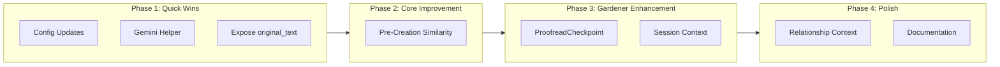

# Immediate Recommendations Implementation Plan

Based on the architecture review session (30 Dec 2025), this plan implements agreed priority items from [`_docs/_evidence/IMMEDIATE_RECOMMENDATIONS.md`](_docs/_evidence/IMMEDIATE_RECOMMENDATIONS.md).---

## Implementation Sequence

---

## Phase 1: Quick Wins (1 hour)

### 1.1 Configuration Updates (Priority 5)

**Files:** [`backend/app/config.py`](backend/app/config.py)

- Reduce `gemini_request_timeout` from 180s to 90s
- Add agent enable flags: `builder_enabled`, `gardener_enabled`, `researcher_enabled`, `librarian_enabled`, `similarity_check_enabled`

### 1.2 Gemini Config Helper (Priority 5b)

**Files:** `backend/app/services/llm_utils.py` (new), [`backend/app/agents/builder.py`](backend/app/agents/builder.py), [`backend/app/agents/gardener.py`](backend/app/agents/gardener.py)

- Create shared `create_gemini_config()` helper enforcing `thinking_budget=0`
- Update Builder and Gardener to use helper

### 1.3 Expose original_text (Priority 2)

**Files:** [`backend/app/models/chunk.py`](backend/app/models/chunk.py), [`backend/app/services/graph_db.py`](backend/app/services/graph_db.py)

- Add `original_text: Optional[str] `to `TranscriptChunk` model
- Update `_chunk_from_value()` to include field

---

## Phase 2: Core Improvement (2-3 hours)

### 2.1 Pre-Creation Similarity Check (Priority 1)

**Files:** [`backend/app/services/builder_service.py`](backend/app/services/builder_service.py), [`backend/app/services/similarity.py`](backend/app/services/similarity.py)

- For each extracted node: generate embedding, query vector index
- If match (score >= 0.92, types compatible, confidence >= 0.7): increment mentions on existing node
- If no match: create new GHOST node with embedding
- Rewire relationships to use canonical node IDs
- Update SSE: `node_updated` for matches, `node_added` for new

**Disambiguation mitigations (ADR-013):**

- Add `_types_compatible()` helper using **embedding similarity** (threshold: 0.80)
- No hardcoded dictionary - respects emergent types architecture
- Require LLM extraction confidence threshold (0.7)
- Add type embedding cache for performance

### 2.2 Rollback Strategy

The `similarity_check_enabled` config flag provides instant rollback:

- Set `SIMILARITY_CHECK_ENABLED=false` to disable without code changes
- Builder reverts to creating all GHOST nodes (pre-change behaviour)
- Gardener continues handling deduplication as before
- No data loss - just more GHOST nodes than optimal

### 2.3 Test Checkpoint

After implementing similarity check, verify:

- [ ] Duplicate entity mentions use existing node (not create new)
- [ ] Mention counts increment correctly
- [ ] Type compatibility prevents "Apple" company matching "apple" fruit
- [ ] Frontend handles `node_updated` SSE event

---

## Phase 3: Gardener Enhancement (2.5-3 hours)

### 3.1 ProofreadCheckpoint Integration (Priority 3)

**Files:** [`backend/app/services/scheduler.py`](backend/app/services/scheduler.py), [`backend/app/services/graph_db.py`](backend/app/services/graph_db.py)

- Add `get_chunks_after(session_id, after_chunk_id, limit)` helper
- Update Gardener to fetch checkpoint, process only new chunks
- Update checkpoint after successful run

### 3.2 Session Context Persistence (Priority 4)

**Files:** [`backend/app/models/vocabulary.py`](backend/app/models/vocabulary.py), [`backend/app/services/graph_db.py`](backend/app/services/graph_db.py), [`backend/app/services/scheduler.py`](backend/app/services/scheduler.py)

- Add `SessionContext` model (theme_summary, key_entities, speaker_names, domain_terms)
- Add CRUD functions for SessionContext
- Include context in Gardener prompt
- Gardener extracts/updates context during cycles

---

## Phase 4: Polish (1 hour)

### 4.1 Relationship Context in Builder (Priority 6)

**Files:** [`backend/app/agents/builder.py`](backend/app/agents/builder.py), [`backend/app/services/builder_service.py`](backend/app/services/builder_service.py)

- Add `_format_existing_relationships()` to prompt rendering
- Pass existing relationships to Builder agent (limit 20)

### 4.2 Documentation Updates (Priority 7)

**Files:** [`_docs/_dev/ADR/`](_docs/_dev/ADR/)

- ~~Create ADR-0011: Pre-creation similarity check decision~~ (DONE)
- ~~Create ADR-0013: Embedding-based type compatibility~~ (DONE)
- Update [`_docs/_START_SESSION_STATE.md`](_docs/_START_SESSION_STATE.md) progress tracker

### 4.3 Frontend SSE Verification

**Files:** `frontend/src/...` (SSE event handlers)

- Verify `node_updated` event handler exists and works correctly
- Test: submit chunk with duplicate entity, confirm UI updates (not adds) node

---

## Testing Checklist

After each phase, verify:

- [ ] Duplicate entity mentions create single GHOST node
- [ ] Mention counts increment for matched nodes
- [ ] Relationships point to correct node IDs
- [ ] Type compatibility prevents false matches
- [ ] Gardener processes only new chunks since checkpoint