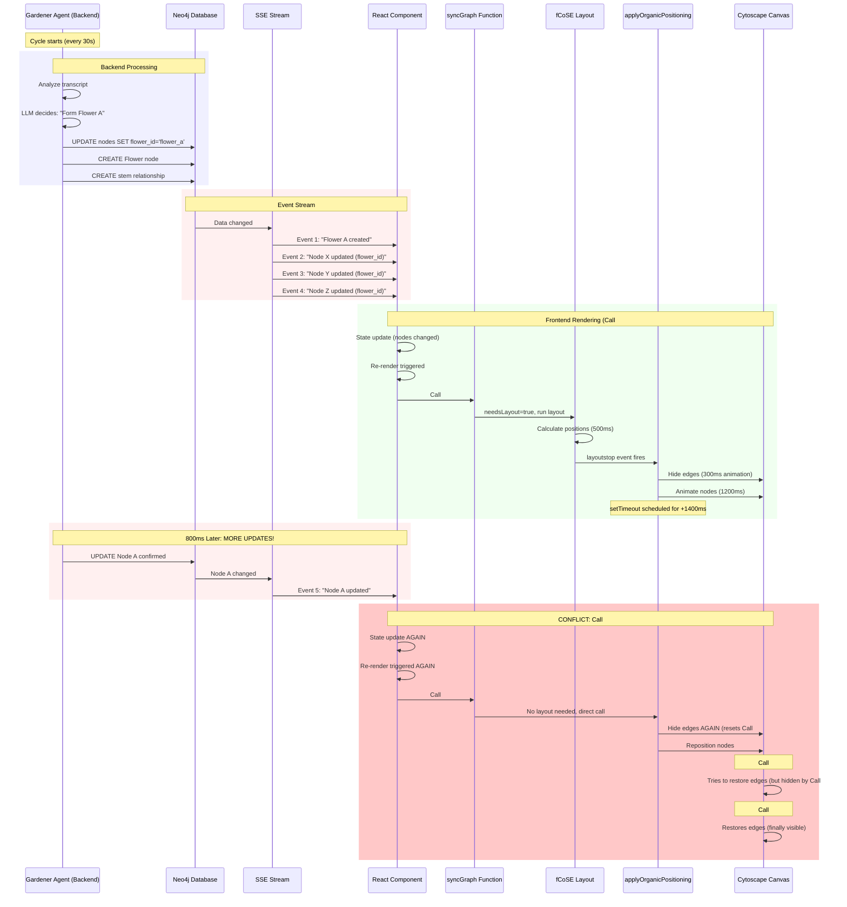

# Complete Information Flow: Gardener to Node Position

**Date:** 19 December 2025  
**Purpose:** Trace the full architecture from backend decision-making to frontend visual rendering

---

## The Complete Flow Diagram



---

## Step-by-Step Breakdown

### Phase 1: Gardener Makes Decisions (Backend)

**Location:** `backend/app/services/scheduler.py` → `_run_gardener()`

**What Happens:**

1. **Gardener cycle triggers** (every 30 seconds by default)
   ```python
   async def _run_gardener(session_id: str):
       # Get recent transcript
       transcript = await chunk_store.get_recent_transcript(session_id, word_limit=1000)
       
       # Get current graph state
       nodes = await graph_db.list_nodes(session_id)
       flowers = await graph_db.list_flowers(session_id)
       
       # Ask LLM: what should we do?
       actions = await gardener_agent.analyze(transcript, nodes, flowers)
   ```

2. **LLM returns actions** (example):
   ```json
   {
     "flower_actions": [
       {
         "action": "form",
         "flower_id": "flower_abc123",
         "label": "AI Concepts",
         "member_ids": ["node_1", "node_2", "node_3", "node_4"],
         "stem_node_id": "node_1"
       }
     ],
     "node_actions": [
       {
         "action": "confirm",
         "node_id": "node_5"
       }
     ]
   }
   ```

3. **Apply actions to database** (one by one):
   ```python
   # First: Create flower
   await graph_db.create_flower(flower_id, label, stem_id)  # → SSE Event 1
   
   # Then: Update each member node
   for node_id in member_ids:
       await graph_db.update_node(node_id, flower_id=flower.id)  # → SSE Event 2, 3, 4...
   
   # Then: Confirm node
   await graph_db.update_node(node_5, status='solid')  # → SSE Event 5
   ```

**Key Point:** Each database operation triggers a **separate SSE event** sent to frontend!

---

### Phase 2: Database Updates Stream to Frontend

**Location:** `backend/app/api/graph.py` → SSE endpoint

**How SSE Works:**

```python
@router.get("/sessions/{session_id}/graph/stream")
async def stream_graph_updates(session_id: str):
    async for event in graph_event_stream(session_id):
        # Each DB change generates an event
        yield {
            "event": "graph_update",
            "data": json.dumps({
                "nodes": await list_nodes(session_id),
                "relationships": await list_relationships(session_id),
                "flowers": await list_flowers(session_id)
            })
        }
```

**Timeline Example:**

```
T=0ms:    Gardener starts applying actions
T=100ms:  CREATE Flower → SSE Event 1 sent
T=150ms:  UPDATE node_1.flower_id → SSE Event 2 sent
T=200ms:  UPDATE node_2.flower_id → SSE Event 3 sent  
T=250ms:  UPDATE node_3.flower_id → SSE Event 4 sent
T=300ms:  UPDATE node_4.flower_id → SSE Event 5 sent
T=800ms:  UPDATE node_5.status → SSE Event 6 sent
```

**Each event contains the ENTIRE graph state** (all nodes, all relationships, all flowers).

---

### Phase 3: Frontend React Receives Events

**Location:** `frontend/src/hooks/useSSE.ts` and `frontend/src/app/sessions/[id]/page.tsx`

**How React Handles Events:**

```typescript
// useSSE hook receives SSE events
const handleMessage = (event: MessageEvent) => {
  const data = JSON.parse(event.data);
  
  // Update React state
  setNodes(data.nodes);           // ← Triggers re-render!
  setRelationships(data.relationships);  // ← Triggers re-render!
  setFlowers(data.flowers);       // ← Triggers re-render!
};
```

**React Component State Updates:**

```typescript
// In SessionPage component
const [nodes, setNodes] = useState<Node[]>([]);
const [relationships, setRelationships] = useState<Relationship[]>([]);
const [flowers, setFlowers] = useState<Flower[]>([]);

// GraphCanvas component watches these props
<GraphCanvas 
  nodes={nodes}            // ← Changes trigger useEffect
  relationships={relationships}  // ← Changes trigger useEffect
  flowers={flowers}        // ← Changes trigger useEffect
/>
```

**React's Batching Behavior:**

In React 18, state updates are **batched** within event handlers BUT **NOT across async events**.

So if 5 SSE events arrive 50ms apart:
- Event 1: `setNodes()` → re-render scheduled
- Event 2: `setNodes()` → re-render scheduled  
- Event 3: `setNodes()` → re-render scheduled
- Event 4: `setNodes()` → re-render scheduled
- Event 5: `setNodes()` → re-render scheduled

**Result:** 5 separate re-renders in quick succession!

---

### Phase 4: GraphCanvas Re-renders Trigger syncGraph

**Location:** `frontend/src/components/graph/GraphCanvas.tsx`

**The Critical useEffect:**

```typescript
// Line 1173-1187
useEffect(() => {
  const cy = cyRef.current;
  if (!cy) return;
  
  syncGraph(cy, { nodes, relationships, flowers }, autoFitTimeoutRef, isAnimatingRef);
  
  return () => {
    // Cleanup
  };
}, [nodes, relationships, flowers]);  // ← Triggers on EVERY prop change
```

**What This Means:**

Every time `nodes`, `relationships`, OR `flowers` changes:
1. useEffect runs
2. `syncGraph()` is called
3. Layout/positioning logic executes

**Timeline Mapping:**

```
T=0ms:    SSE Event 1 arrives (flower created)
T=10ms:   React state updates
T=20ms:   GraphCanvas re-renders
T=30ms:   useEffect triggers → syncGraph Call #1 starts

T=50ms:   SSE Event 2 arrives (node updated)
T=60ms:   React state updates
T=70ms:   GraphCanvas re-renders
T=80ms:   useEffect triggers → syncGraph Call #2 starts (Call #1 still running!)

T=100ms:  SSE Event 3 arrives (node updated)
T=110ms:  React state updates
T=120ms:  GraphCanvas re-renders
T=130ms:  useEffect triggers → syncGraph Call #3 starts (Calls #1 & #2 still running!)
```

**This is the root of the race condition!**

---

### Phase 5: syncGraph Decides What to Do

**Location:** `frontend/src/components/graph/GraphCanvas.tsx` → `syncGraph()`

**Decision Tree:**

```typescript
function syncGraph(cy, data, autoFitTimeoutRef, isAnimatingRef) {
  let needsLayout = false;
  
  // Add/update nodes
  data.nodes.forEach(node => {
    if (!cy.getElementById(node.id).nonempty()) {
      cy.add({ /* new node */ });
      needsLayout = true;  // ← New element added
    }
  });
  
  // Add/update edges
  data.relationships.forEach(rel => {
    if (!cy.getElementById(rel.id).nonempty()) {
      cy.add({ /* new edge */ });
      needsLayout = true;  // ← New element added
    }
  });
  
  // DECISION POINT:
  if (needsLayout && cy.elements().length > 0) {
    // Path A: Run fCoSE layout (new elements added)
    const layout = cy.elements().layout(FCOSE_OPTIONS);
    layout.run();
    
    layout.one('layoutstop', () => {
      setTimeout(() => {
        applyOrganicJitter(cy, data);
        applyOrganicPositioning(cy, data);  // ← Call via layoutstop
        scheduleAutoFit(cy, autoFitTimeoutRef, isAnimatingRef, 1800);
      }, 50);
    });
    
  } else if (cy.elements().length > 0) {
    // Path B: No layout needed, but update positions (data changed)
    setTimeout(() => {
      applyOrganicJitter(cy, data);
      applyOrganicPositioning(cy, data);  // ← Direct call
      scheduleAutoFit(cy, autoFitTimeoutRef, isAnimatingRef, 1800);
    }, 50);
  }
}
```

**When Does Each Path Execute?**

**Path A (needsLayout=true):**
- First time flower members appear
- New nodes added
- New edges created

**Path B (needsLayout=false):**
- Node properties changed (e.g., status updated)
- Flower already exists, member list unchanged
- Any data update that doesn't add new elements

**The Problem:**

If Call #1 takes Path A (layoutstop event, 500ms delay) and Call #2 takes Path B (direct call, 50ms delay):

```
T=30ms:   Call #1 starts → Path A → waits for layoutstop
T=80ms:   Call #2 starts → Path B → calls applyOrganicPositioning immediately (T=130ms)
T=530ms:  Call #1 layoutstop fires → calls applyOrganicPositioning

Result: applyOrganicPositioning called twice, 400ms apart!
```

---

### Phase 6: applyOrganicPositioning Animations

**Location:** `frontend/src/components/graph/GraphCanvas.tsx` → `applyOrganicPositioning()`

**What Happens:**

```typescript
function applyOrganicPositioning(cy, data) {
  // PHASE 1: Hide edges (300ms animation)
  const affectedEdges = cy.edges().filter(/* ... */);
  affectedEdges.animate({ style: { opacity: 0 } }, { duration: 300 });
  
  // PHASE 2: Calculate and animate node positions (1200ms)
  flowerMembers.forEach((members, flowerId) => {
    // Calculate petal positions
    const targetPos = { x: ..., y: ... };
    
    // Animate nodes to new positions
    cyNode.animate({
      position: targetPos,
      style: { /* size */ }
    }, {
      duration: 1200,
      easing: 'ease-in-out'
    });
  });
  
  // PHASE 3: Restore edges after animations complete (1400ms delay)
  setTimeout(() => {
    affectedEdges.animate({ style: { opacity: 1 } }, { duration: 600 });
  }, 1400);  // ← Hardcoded delay
}
```

**State Tracking:** **NONE**

There is no:
- Lock to prevent concurrent calls
- Queue for pending updates
- Cancel mechanism for in-flight animations
- State variable tracking "is animating"

**Each call is independent and doesn't know about others!**

---

### Phase 7: Animation Conflicts

**Scenario: Two Calls 400ms Apart**

```
Call #1 Timeline:
T=0ms:     Hide edges (start 300ms fade)
T=300ms:   Edges hidden, start node animation (1200ms)
T=1500ms:  Node animation complete
T=1400ms:  setTimeout fires → restore edges (600ms fade)
T=2000ms:  Edges fully restored

Call #2 Timeline (starts at T=400ms):
T=400ms:   Hide edges AGAIN (start 300ms fade) ← CONFLICT!
T=700ms:   Edges hidden again, start node animation (1200ms)
T=1900ms:  Node animation complete
T=1800ms:  setTimeout fires → restore edges (600ms fade)
T=2400ms:  Edges fully restored

What User Sees:
T=0-300ms:    Edges fading out
T=300-400ms:  Edges briefly hidden
T=400-700ms:  Edges fading out AGAIN (flicker!)
T=700-1400ms: Edges hidden
T=1400ms:     Call #1 tries to restore (but Call #2 already hid them)
T=1400-1800ms: Edges partially visible, then hidden again
T=1800-2400ms: Edges fading in (finally stable)
```

**Why Nodes Jump:**

```
Call #1: 
- Calculates petal positions based on current stem location
- Stem at position (500, 300)
- Petal A should be at (500, 150)
- Starts 1200ms animation

Call #2 (400ms later):
- fCoSE may have moved stem to (600, 350)
- Recalculates: Petal A should NOW be at (600, 200)  
- Starts NEW 1200ms animation (interrupts Call #1)
- Result: Petal A was animating to (500, 150), now jumps to animate to (600, 200)
```

---

## Current vs Proposed Architecture

### Current Architecture (No Coordination)

```
SSE Event → React Update → syncGraph → Immediate Execution
SSE Event → React Update → syncGraph → Immediate Execution (overlaps!)
SSE Event → React Update → syncGraph → Immediate Execution (overlaps!!)
```

**Characteristics:**
- Fire-and-forget
- No state tracking
- No animation awareness
- Rapid successive calls cause conflicts

---

### Proposed Architecture (State Machine)

```
SSE Event → React Update → syncGraph → Check if animating
                                     ↓
                          YES ← Queue update for later
                                     ↓
                          NO ← Lock state → Execute → Unlock → Process queue
```

**Characteristics:**
- Single animation at a time
- Queued updates processed sequentially
- No conflicts or overlaps
- Predictable behavior

---

## Why You See Repeated Behavior

### Example: Gardener Forms Two Flowers 1 Second Apart

**Gardener Actions:**

```
T=0s:     Form Flower A (4 nodes)
          ↓
          CREATE Flower A
          UPDATE node_1.flower_id = 'flower_a'
          UPDATE node_2.flower_id = 'flower_a'
          UPDATE node_3.flower_id = 'flower_a'
          UPDATE node_4.flower_id = 'flower_a'
          → 5 SSE events sent

T=1s:     Form Flower B (3 nodes)  
          ↓
          CREATE Flower B
          UPDATE node_5.flower_id = 'flower_b'
          UPDATE node_6.flower_id = 'flower_b'
          UPDATE node_7.flower_id = 'flower_b'
          → 4 SSE events sent
```

**Frontend Timeline:**

```
T=0.0s:   SSE Event 1 (Flower A created) → syncGraph Call #1
T=0.05s:  SSE Event 2 (node_1 updated) → syncGraph Call #2
T=0.1s:   SSE Event 3 (node_2 updated) → syncGraph Call #3
T=0.15s:  SSE Event 4 (node_3 updated) → syncGraph Call #4
T=0.2s:   SSE Event 5 (node_4 updated) → syncGraph Call #5

T=0.5s:   Call #1 layoutstop fires → applyOrganicPositioning (Call #A)
T=0.55s:  Call #2 takes Path B → applyOrganicPositioning (Call #B) (conflicts with A!)
T=0.6s:   Call #3 takes Path B → applyOrganicPositioning (Call #C) (conflicts with A & B!)
T=0.65s:  Call #4 takes Path B → applyOrganicPositioning (Call #D) (conflicts with A, B, C!)
T=0.7s:   Call #5 takes Path B → applyOrganicPositioning (Call #E) (conflicts with all!)

T=1.0s:   SSE Event 6 (Flower B created) → syncGraph Call #6
T=1.05s:  SSE Event 7 (node_5 updated) → syncGraph Call #7
T=1.1s:   SSE Event 8 (node_6 updated) → syncGraph Call #8
T=1.15s:  SSE Event 9 (node_7 updated) → syncGraph Call #9

T=1.5s:   Call #6 layoutstop fires → applyOrganicPositioning (Call #F)
          (Calls A-E still have timeouts pending!)
          
T=1.9s:   Call #A setTimeout fires (1400ms after T=0.5s)
T=1.95s:  Call #B setTimeout fires
T=2.0s:   Call #C setTimeout fires
T=2.05s:  Call #D setTimeout fires
T=2.1s:   Call #E setTimeout fires
T=2.9s:   Call #F setTimeout fires
```

**What You See:**
- Edges flicker 6+ times
- Nodes reposition 6+ times
- Auto-fit triggers 6+ times
- Chaos

---

## Solution: Animation State Machine

### Implementation Concept:

```typescript
const animationState = useRef({
  isRunning: false,
  currentCall: null,
  queue: []
});

function applyOrganicPositioning(cy, data) {
  // Check if already running
  if (animationState.current.isRunning) {
    console.log('[Organic Positioning] Already running, queueing update');
    animationState.current.queue.push(data);
    return;
  }
  
  // Lock state
  animationState.current.isRunning = true;
  animationState.current.currentCall = Date.now();
  
  console.log('[Organic Positioning] Starting animation');
  
  // Run animations...
  const affectedEdges = cy.edges().filter(...);
  affectedEdges.animate({ style: { opacity: 0 } }, { duration: 300 });
  
  // ... node animations (1200ms) ...
  
  // Unlock after EVERYTHING completes (including edge restoration)
  const totalDuration = 300 + 1200 + 600;  // fade-out + nodes + fade-in
  setTimeout(() => {
    console.log('[Organic Positioning] Animation complete');
    
    animationState.current.isRunning = false;
    animationState.current.currentCall = null;
    
    // Process next queued update if any
    if (animationState.current.queue.length > 0) {
      const nextData = animationState.current.queue.shift();
      console.log('[Organic Positioning] Processing queued update');
      applyOrganicPositioning(cy, nextData);
    }
  }, totalDuration);
}
```

### With State Machine:

```
T=0.5s:   Call #1 → Lock state → Execute
T=0.55s:  Call #2 → State locked → Queue
T=0.6s:   Call #3 → State locked → Queue
T=0.65s:  Call #4 → State locked → Queue
T=0.7s:   Call #5 → State locked → Queue

T=2.6s:   Call #1 completes (2100ms later) → Unlock
T=2.6s:   Process Call #2 from queue → Lock → Execute

T=4.7s:   Call #2 completes → Unlock
T=4.7s:   Process Call #3 from queue → Lock → Execute

... and so on
```

**Result:** Sequential, predictable, no conflicts!

---

## Questions This Answers

### Q: Why do edges flicker?
**A:** Multiple `applyOrganicPositioning` calls overlap, each hiding/showing edges independently.

### Q: Why do nodes jump instantly?
**A:** fCoSE recalculates positions between calls, and new calls start animations to new positions before old ones finish.

### Q: Why does it repeat?
**A:** Each SSE event triggers a new React render, which triggers syncGraph, which calls positioning functions.

### Q: How does Gardener timing affect this?
**A:** Gardener applies actions sequentially (one DB update at a time), each generating an SSE event. The faster Gardener works, the more events arrive in quick succession.

### Q: Why don't the edges wait until nodes settle?
**A:** The `setTimeout(1400)` is hardcoded and doesn't check if another call started. It fires regardless of actual animation state.

---

## Next Steps

Now that you understand the full flow, which solution would you like me to implement?

1. **Animation State Machine** (Robust, prevents overlaps)
2. **Debounce syncGraph** (Simple, adds 300-500ms delay)
3. **Increase edge hide duration** (Quick fix, 1400ms → 3500ms)
4. **Batch SSE events on frontend** (Accumulate events for 300ms before processing)

I recommend **#1 (State Machine) + #3 (Quick fix)** for best results.
